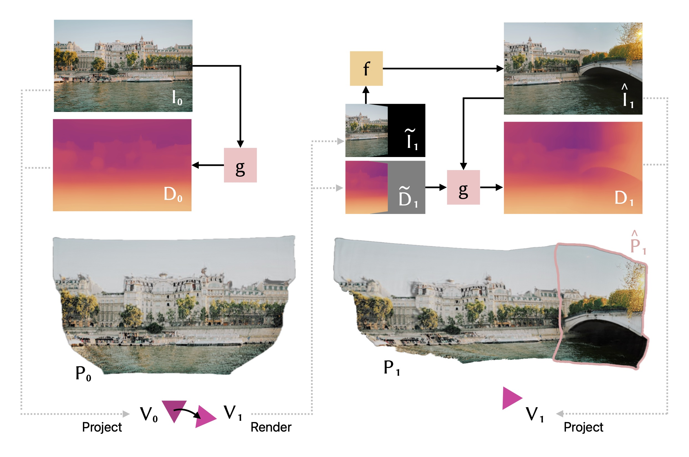

# Invisible Stitch: Generating Smooth 3D Scenes with Depth Inpainting
Paul Engstler, Andrea Vedaldi, Iro Laina, Christian Rupprecht<br>
[Project Page](https://research.paulengstler.com/invisible-stitch) | [🤗 Demo](https://huggingface.co/spaces/paulengstler/invisible-stitch) | [Paper](https://arxiv.org/abs/2404.19758)<br>



This repository contains the code to train the depth completion network, generate 3D scenes, and run the scene geometry evaluation benchmark as presented in the paper "Invisible Stitch: Generating Smooth 3D Scenes with Depth Inpainting".

Abstract: *3D scene generation has quickly become a challenging new research direction, fueled by consistent improvements of 2D generative diffusion models. Most prior work in this area generates scenes by iteratively stitching newly generated frames with existing geometry.  These works often depend on pre-trained monocular depth estimators to lift the generated images into 3D, fusing them with the existing scene representation. These approaches are then often evaluated via a text metric, measuring the similarity between the generated images and a given text prompt. In this work, we make two fundamental contributions to the field of 3D scene generation. First, we note that lifting images to 3D with a monocular depth estimation model is suboptimal as it ignores the geometry of the existing scene. We thus introduce a novel depth completion model, trained via teacher distillation and self-training to learn the 3D fusion process, resulting in improved geometric coherence of the scene. Second, we introduce a new benchmarking scheme for scene generation methods that is based on ground truth geometry, and thus measures the quality of the structure of the scene.*

## Release Roadmap
- [x] Inference
- [ ] High-Quality Gaussian Splatting Results (see `gs.py:102`)
- [x] Training
- [ ] Benchmark

## Getting Started
Please pull this repository recursively to obtain the required submodules.
```
git clone --recursive https://github.com/paulengstler/invisible-stitch.git
```

Use `environment.yml` file to create a Conda environment with all requirements for this project.

```
conda env create -n invisible_stitch --file environment.yml
conda activate invisible_stitch
```

By default, the pre-trained checkpoint of our depth completion model will be downloaded automatically from Hugging Face. If you prefer to download it manually, find the model [here](https://huggingface.co/paulengstler/invisible-stitch) and adapt the `run.py` script(s).

## Inference

To generate a 3D scene, invoke the `run.py` script:

```shell
python3 run.py \
  --image "examples/photo-1667788000333-4e36f948de9a.jpeg" \
  --prompt "a street with traditional buildings in Kyoto, Japan" \
  --output_path "output.ply" \
  --mode "stage"
```

For the parameter `mode`, you may provide one of the following arguments:

* `single`: Simple depth projection of the input image (no hallucation)
* `stage`: Single-step hallucination of the scene to the left and right of the input image
* `360`: Full 360-degree hallucination around the given input image 

## Training

### Dataset Setup

To train the depth completion network from a fine-tuned ZoeDepth model, we need to generate some data first. First, we predict depth for [NYU Depth v2](https://cs.nyu.edu/~fergus/datasets/nyu_depth_v2.html) with [Marigold](https://github.com/prs-eth/Marigold). Second, we use Marigold again to predict the depth for [Places365](http://places.csail.mit.edu). Third, we use the depth maps for Places365 to generate inpainting masks.

Places365 can be used as-is. For NYU Depth v2, please follow the instructions [here](https://github.com/cleinc/bts/tree/master/pytorch#nyu-depvh-v2) to download the split that we use. It is the same one used for ZoeDepth. We also need the official splits for NYU Depth v2:

```shell
wget http://horatio.cs.nyu.edu/mit/silberman/nyu_depth_v2/nyu_depth_v2_labeled.mat
python extract_official_train_test_set_from_mat.py nyu_depth_v2_labeled.mat splits.mat ./nyu_depth_v2/official_splits/
```

Next, please update the paths in `predict_nyu_marigold.py`, `predict_places_marigold.py`, and `project_places_depth_preds.py`. Then run these files in this sequence. These scripts are equipped with `submitit` to be distributed across a SLURM cluster. If possible, we strongly suggest parallelizing the workload.

Finally, make sure to update the paths in `zoedepth/utils/config.py:96-175`. All done!

### Training the Model

```shell
python3 train.py -m zoedepth -d marigold_nyu \
 --batch_size=12 --debug_mode=0 \
 --save_dir="checkpoints/"
```

Consider using the `_latest.pt` as opposed to the `_best.pt` checkpoint.

## Citation
```
@inproceedings{
    engstler2024invisible,
    title={Invisible Stitch: Generating Smooth 3D Scenes with Depth Inpainting}
    author={Paul Engstler and Andrea Vedaldi and Iro Laina and Christian Rupprecht}
    year={2024}
    booktitle={Arxiv}
}
```

## Acknowledgments

P. E., A. V., I. L., and C.R. are supported by ERC-UNION- CoG-101001212. P.E. is also supported by Meta Research. I.L. and C.R. also receive support from VisualAI EP/T028572/1.

Without the great works from previous researchers, this project would not have been possible. Thank you! Our code for the depth completion network heavily borrows from [ZoeDepth](https://github.com/isl-org/ZoeDepth). We utilize [PyTorch3D](https://pytorch3d.org) in our 3D scene generation pipeline.